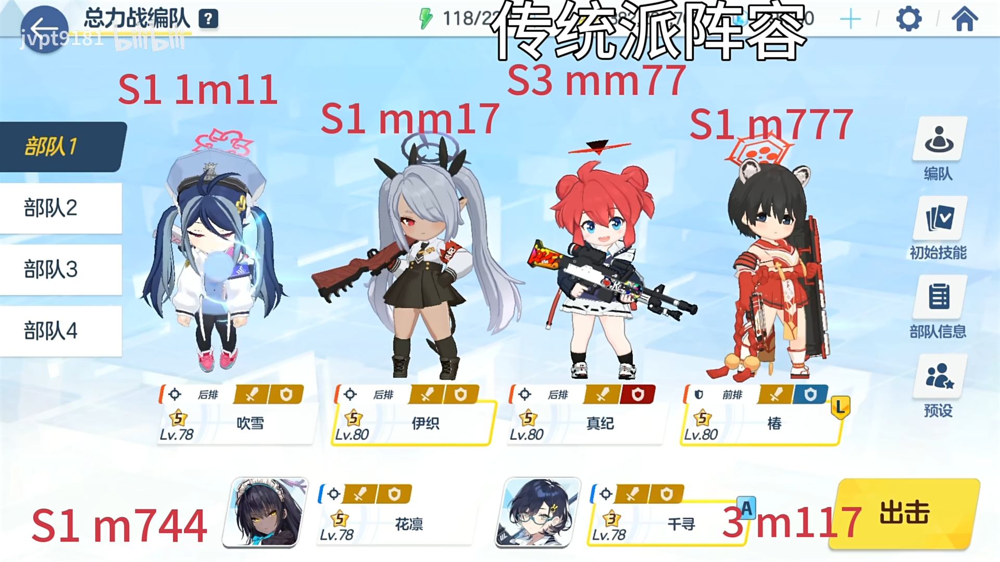
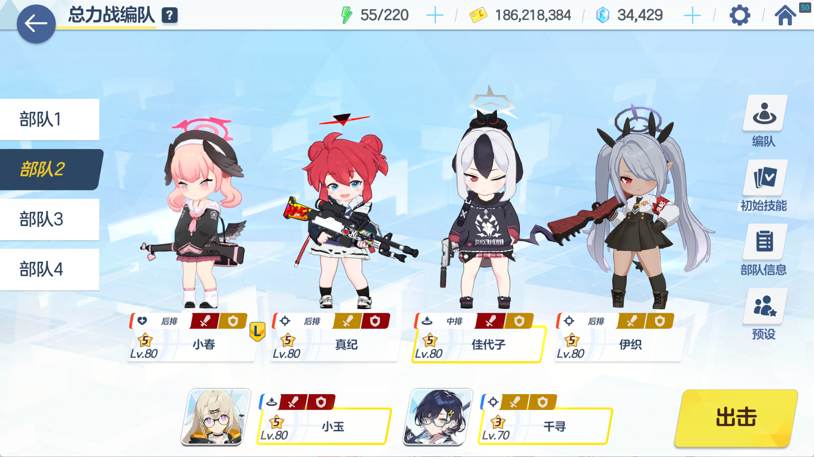
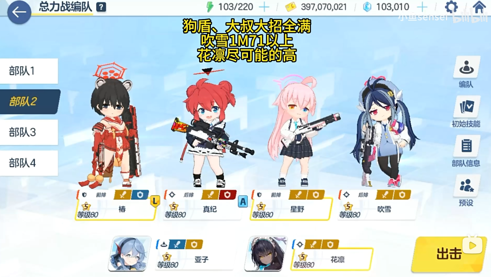
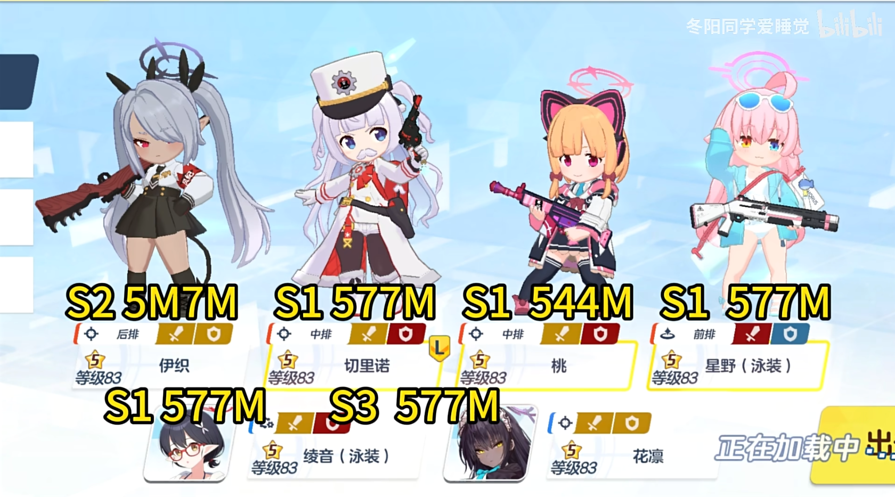
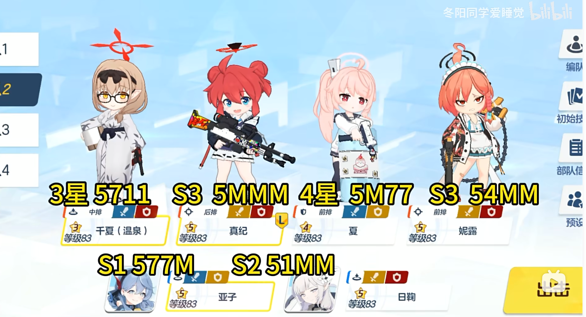

# 总力战

记一个自用的总力战摆烂合集。

## 黑白

### INS 逃课

https://www.bilibili.com/video/BV1NT421D7Pd

```

```


## 霍得

### EX摆烂轴

https://www.bilibili.com/video/BV1mW421R7to



```
吹雪 伊织（初始技能） 真纪 椿（初始技能）
花凛 千寻（初始技能）
3c千寻ex
3c伊织ex
10c狗盾ex，需要凹一下花凛ns的眩晕，不然填不满条。
7c花凛ex➕真纪ex
转场：主要在真纪油漆弹破防后放输出技能。
9.5c千寻ex给第一个柱子，狗盾ex
4c伊织ex打柱子
9c花凛ex
7c千寻ex(过牌用)
7c真纪ex+伊织ex（在真纪油漆弹后放）
6c狗盾ex眩晕boss(防止它召唤柱子)
6c花凛ex+真纪ex（在真纪油漆弹后放）
3c千寻ex（过牌）
4c伊织ex+花凛ex（真纪油漆弹后）
```

### INS 清票刀 摆烂刀

参考：https://www.bilibili.com/video/BV1Pi421Y7So

**第一刀**



**第二刀**



**文字轴**

```
第一刀小春保全队不死，先放cc角色技能，cc槽满按部就班清柱子就可以了。
然后见到霍得后不放主动cc，用真纪伊织直接打本体刮点伤害（不要让霍得cc满）。

第二刀
9C大叔喷桂子+本体
5C狗盾
4C花凛打上面柱子
9C亚子给真纪（保证后面吃亚子）
6C大叔喷柱子+本体
柱子倒了之后
最速放真纪+花凛
满费亚子
【要点】
霍德释放柱子动画的一瞬间放狗盾（下蹲）
秒放真纪+花凛
后面就大叔亚子真纪花凛循环即可
```


## 切赛德（球）

### 野外 INS

参考：https://www.bilibili.com/video/av113049277039510

**第一刀**



**第二刀**（或堆尸后的第n刀）



**文字轴**

```
【第一刀】
4.5c小桃
5c水星野
5~7c切里诺
10c直升机
9~10c小桃+伊织
10c水星野
10c花凛
7c切里诺
转场前直升机
=====转场======
10c水星野+桃+伊织
10c直升机
7c切里诺
7c桃:伊织
5c水星野
7c直升机+桃
=====开壳=======
花凛t伊织
9c直升机
9c水星野
7c切里诺
7c桃+伊织
5c直升机
最后一波伊织+桃卡黄条
（球压在30管血以内，血条x处，不够堆尸）
5c切里诺
【第二刀】
9~10c温泉针
10c亚子
8c真纪ns后 真纪+反手轮椅
5c妮露+反手亚子

```

